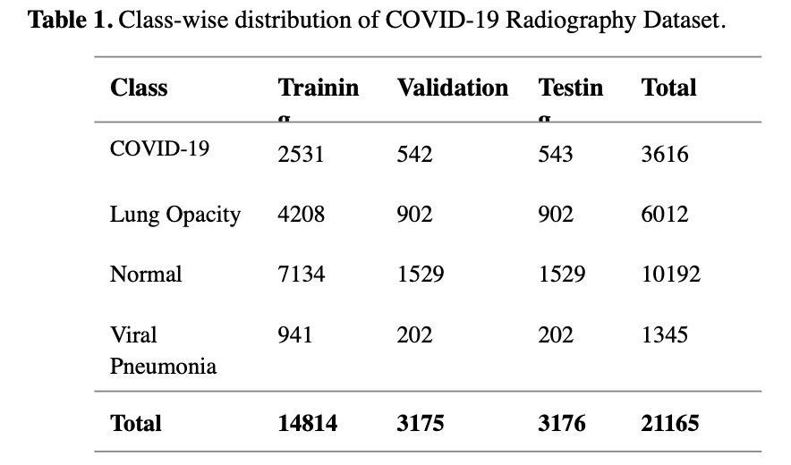

# 🩺 Chest X-ray Disease Detection using Fine-Tuned ResNet50 & Grad-CAM

<div align="center">


### Explainable AI for Multi-Class Chest X-ray Disease Classification

**Deep Learning • Computer Vision • Medical Imaging • Explainable AI**

</div>

---

## 📖 Overview

This repository contains the implementation of a deep learning model for **multi-class chest X-ray disease classification** using **Transfer Learning with ResNet50** and **Grad-CAM Explainable AI**.

The model classifies chest radiographs into four clinically important categories:

- 🦠 COVID-19
- 🌫 Lung Opacity
- 🫁 Viral Pneumonia
- ✅ Normal

The project was developed as my **Bachelor of Technology Final Year Research Project** and presented at the **2026 Second International Conference on Computer Science, Electrical, Electronics and Communication Technologies (IEEE CE2CT 2026)**.

---

## 📄 Research Publication

### Fine-Tuned ResNet50 for Multi-Class Chest X-ray Classification using Explainable Deep Learning

**Conference:** IEEE CE2CT 2026

**Venue:** Graphic Era Hill University, Bhimtal, Uttarakhand, India

**Author Role**

- 👨‍💻 First Author
- 🎤 Conference Presenter
- 📚 Accepted in IEEE CE2CT 2026 Proceedings
- 🔬 Proceedings submitted to IEEE Xplore

> DOI / IEEE Xplore link will be added after publication.

---

# 🎯 Research Objectives

- Develop a deep learning model for chest disease classification.
- Improve diagnostic accuracy using Transfer Learning.
- Compare Baseline CNN with Fine-Tuned ResNet50.
- Integrate Grad-CAM for Explainable AI.
- Support transparent AI-assisted medical imaging research.

---

# 🩻 Disease Classes

| Disease | Description |
|---------|-------------|
| COVID-19 | COVID infected chest X-ray. |
| Lung Opacity | Opacity caused by lung infection. |
| Viral Pneumonia | Viral pneumonia chest radiograph. |
| Normal | Healthy chest X-ray. |

---

# 📂 Dataset

### COVID-19 Radiography Database

This project uses the **COVID-19 Radiography Database** from Kaggle.

- Total Images: **21,165**
- Number of Classes: **4**
- Image Type: Chest X-ray
- Image Size: **224 × 224**

### 📊 Dataset Distribution

<p align="center">

</p>

| Class | Training | Validation | Testing | Total |
|-------|---------:|-----------:|---------:|------:|
| COVID-19 | 2531 | 542 | 543 | 3616 |
| Lung Opacity | 4208 | 902 | 902 | 6012 |
| Normal | 7134 | 1529 | 1529 | 10192 |
| Viral Pneumonia | 941 | 202 | 202 | 1345 |
| **Total** | **14814** | **3175** | **3176** | **21165** |

---

# 🩻 Representative Chest X-ray Images

The figure below shows representative chest radiographs used during model training.

<p align="center">

</p>

**Figure:** COVID-19, Lung Opacity, Viral Pneumonia and Normal chest X-ray images.

---

# 🧠 Model Architecture

## Fine-Tuned ResNet50

The model is built using **Transfer Learning** on the pretrained ResNet50 network.

### Pipeline

1. Dataset preprocessing.
2. Data augmentation.
3. Image resizing (224×224).
4. Transfer Learning using pretrained ImageNet weights.
5. Fine-tuning upper ResNet50 layers.
6. Softmax multi-class classification.
7. Grad-CAM visualization.

---

# ⚙️ Technologies Used

## Programming Languages

- Python
- C++

## Deep Learning

- TensorFlow
- Keras
- ResNet50
- Grad-CAM

## Data Processing

- NumPy
- Pandas
- Matplotlib
- OpenCV
- Scikit-learn

## Environment

- Google Colab
- Jupyter Notebook
- Git
- GitHub

---

# 🔄 Data Preprocessing

The preprocessing pipeline includes:

- Resize images to **224 × 224**
- Normalize pixel values.
- Data augmentation.
- Random rotation.
- Horizontal flip.
- Zoom augmentation.
- Train / Validation / Test split.

---

# 🚀 Model Training

## Training Strategy

- Transfer Learning with ResNet50.
- ImageNet pretrained weights.
- Frozen base layers initially.
- Fine-tuned upper convolution blocks.
- Adam Optimizer.
- Early Stopping.
- Reduce Learning Rate on Plateau.

## Training Configuration

| Parameter | Value |
|-----------|------|
| Image Size | 224×224 |
| Batch Size | 32 |
| Optimizer | Adam |
| Learning Rate | 0.0001 |
| Loss Function | Categorical Crossentropy |
| Output Layer | Softmax (4 Classes) |

---

# 📊 Performance Comparison

The Fine-Tuned ResNet50 significantly outperformed the baseline CNN model.

<p align="center">

</p>

| Metric | Baseline CNN | Fine-Tuned ResNet50 |
|--------|-------------:|--------------------:|
| Accuracy | 77.17% | **90.00%** |
| Precision | 0.78 | **0.90** |
| Recall | 0.77 | **0.90** |
| F1-Score | 0.76 | **0.90** |

### Improvement

- +12.83% higher accuracy.
- Better precision and recall.
- Better F1-score across all disease classes.

---

# 📈 Class-wise Performance

<p align="center">

</p>

| Class | Precision | Recall | F1 Score |
|-------|----------:|-------:|---------:|
| COVID-19 | 0.94 | 0.85 | 0.89 |
| Lung Opacity | 0.89 | 0.84 | 0.87 |
| Normal | 0.88 | 0.94 | 0.91 |
| Viral Pneumonia | **0.95** | **0.94** | **0.95** |
| Macro Average | 0.92 | 0.89 | 0.90 |
| Weighted Average | 0.90 | 0.90 | 0.90 |

---

# 📊 Confusion Matrix

The confusion matrix evaluates class-wise prediction performance on the test dataset.

<p align="center">

</p>

### Observations

- Strong prediction performance across all classes.
- Highest recall for **Normal** and **Viral Pneumonia**.
- Minor confusion between **COVID-19** and **Lung Opacity**.

---

# 🔥 Explainable AI using Grad-CAM

Grad-CAM generates heatmaps showing the lung regions responsible for predictions.

<p align="center">

</p>

### Why Grad-CAM?

- Improves model interpretability.
- Highlights disease-related lung regions.
- Makes predictions more transparent.
- Supports Explainable AI research in medical imaging.

---

# 💻 Installation

Clone the repository.

```bash
git clone https://github.com/amansaifi699/Chest-Xray-Disease-Detection.git
```

Enter the project.

```bash
cd Chest-Xray-Disease-Detection
```

Install dependencies.

```bash
pip install -r requirements.txt
```

---

# ▶️ Run the Project

### Train Model

```bash
python src/train.py
```

### Evaluate Model

```bash
python src/evaluate.py
```

### Predict a Chest X-ray

```bash
python src/predict.py --image sample_xray.png
```

---

# 📁 Repository Structure

```text
Chest-Xray-Disease-Detection/
│
├── README.md
├── notebook/
│   └── Chest_Xray_Research_Notebook.ipynb
│
├── model/
│   └── resnet50_covid_model.h5
│
├── src/
│   ├── train.py
│   ├── evaluate.py
│   ├── predict.py
│   ├── gradcam.py
│   └── utils.py
│
├── images/
│   ├── dataset_distribution.png
│   ├── sample_xrays.png
│   ├── performance_comparison.png
│   ├── classification_metrics.png
│   ├── confusion_matrix.png
│   └── gradcam_visualization.png
│
├── requirements.txt
├── LICENSE
└── .gitignore
```

---

# 📌 Key Features

- Multi-Class Chest X-ray Classification.
- Transfer Learning with ResNet50.
- Explainable AI using Grad-CAM.
- Medical Image Preprocessing.
- Classification Report.
- Confusion Matrix Visualization.
- Research-Oriented Implementation.

---

# 🎓 Academic Context

This project was completed during my **Bachelor of Technology in Computer Science & Engineering**.

**Institution:** IMS Engineering College, Ghaziabad (Affiliated to Dr. A.P.J. Abdul Kalam Technical University, AKTU)

### Research Areas

- Artificial Intelligence
- Deep Learning
- Computer Vision
- Medical Imaging
- Explainable AI

---

# 👨‍💻 Author

## Aman

B.Tech Computer Science & Engineering

IMS Engineering College (AKTU)

### Research Interests

- Artificial Intelligence
- Machine Learning
- Computer Vision
- Medical AI
- Explainable AI

### Connect with Me

- GitHub: **amansaifi699**
- LinkedIn: **aman-b8808924a**
- Email: **amanshooter4@gmail.com**

---

# 🙏 Acknowledgements

- TensorFlow
- Keras
- ResNet50 (ImageNet Pretrained Model)
- COVID-19 Radiography Database
- IEEE CE2CT 2026 Conference

---

# 📜 License

This repository is released under the **MIT License** for academic and research purposes.

> **Disclaimer:** This repository is intended for educational and research purposes only. It is not a clinical diagnostic tool or a substitute for professional medical advice.

---

<div align="center">

### ⭐ If you found this project useful, consider giving it a star!

**Built with ❤️ for AI Research and Medical Imaging**

</div>
