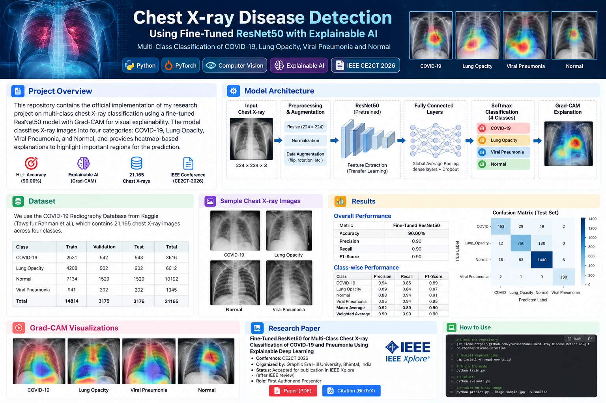
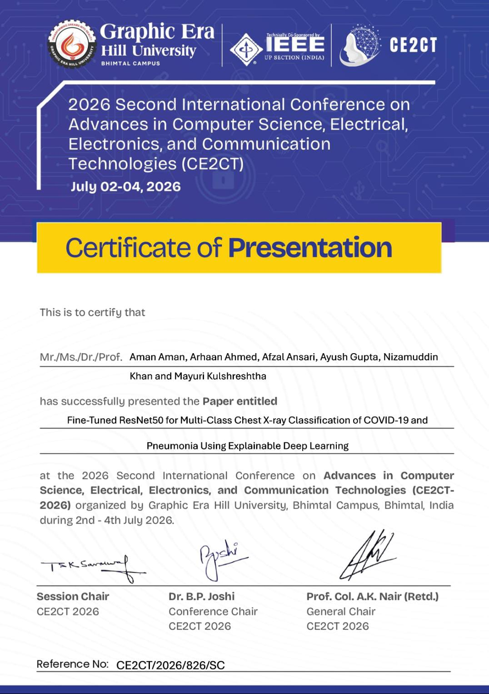
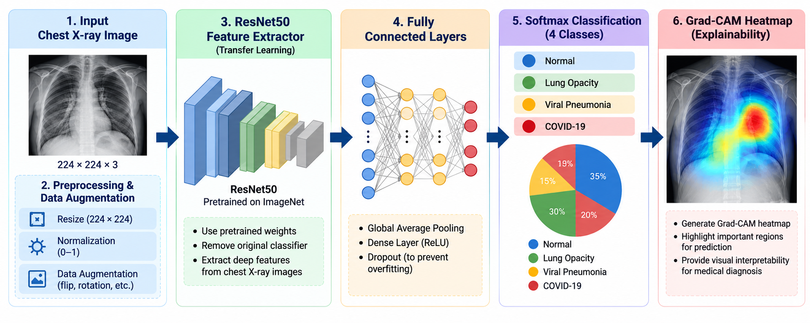

# 🫁 Chest X-ray Disease Detection using Fine-Tuned ResNet50 with Explainable AI

<p align="center">
  
</p>

<h3 align="center">
Multi-Class Chest X-ray Classification using Transfer Learning and Grad-CAM
</h3>

<p align="center">
COVID-19 • Lung Opacity • Viral Pneumonia • Normal
</p>

<p align="center">


</p>

<p align="center">
<b>First Author Research Project • IEEE CE2CT 2026 Proceedings</b>
</p>

---

## 🚀 Project Highlights

- 🔬 Fine-tuned **ResNet50** using transfer learning for multi-class chest X-ray disease classification.
- 🧠 Integrated **Grad-CAM** to generate explainable heatmaps highlighting disease-specific regions.
- 🫁 Classifies chest radiographs into **four clinically relevant pulmonary disease categories**.
- 📊 Trained and evaluated on the **COVID-19 Radiography Database** containing **21,165 chest X-ray images**.
- 📄 Presented at **CE2CT 2026**, with conference proceedings accepted for publication in **IEEE Xplore** after IEEE review.

---

## 📚 Table of Contents

- [Project Overview](#-project-overview)
- [Research Information](#-research-information)
- [Conference Presentation](#-conference-presentation)
- [Why This Project?](#-why-this-project)
- [Project Summary](#-project-summary)
- [Dataset](#-dataset)
- [Model Architecture](#-model-architecture)
- [Installation](#-installation)
- [Repository Structure](#-repository-structure)
- [Results](#-results)
- [Grad-CAM Explainability](#-grad-cam-explainability)
- [Research Paper](#-research-paper)
- [Citation](#-citation)
- [Medical Disclaimer](#-medical-disclaimer)
- [License](#-license)

---

# 📖 Project Overview

Chest X-ray interpretation is one of the most widely used imaging techniques for diagnosing pulmonary diseases. This repository presents the implementation of my research project on **multi-class chest X-ray disease classification** using a **fine-tuned ResNet50** deep learning model integrated with **Gradient-weighted Class Activation Mapping (Grad-CAM)** for visual interpretability.

The model classifies chest radiographs into four clinically relevant categories:

- COVID-19
- Lung Opacity
- Viral Pneumonia
- Normal

The objective of this work is to combine **high classification performance** with **Explainable AI (XAI)**, enabling visualization of image regions influencing model predictions.

---

# 📑 Research Information

| Item | Details |
|------|---------|
| **Paper Title** | *Fine-Tuned ResNet50 for Multi-Class Chest X-ray Classification of COVID-19 and Pneumonia Using Explainable Deep Learning* |
| **Conference** | CE2CT 2026 – Second International Conference on Advances in Computer Science, Electrical, Electronics and Communication Technologies |
| **Organizer** | Graphic Era Hill University, Bhimtal Campus, India |
| **Role** | **First Author & Presenter** |
| **Research Area** | Medical AI, Computer Vision, Explainable AI |
| **Publication Status** | CE2CT 2026 conference proceedings accepted for publication in IEEE Xplore after IEEE review. |

---

# 🎤 Conference Presentation

This research work was successfully presented at the **2026 Second International Conference on Advances in Computer Science, Electrical, Electronics and Communication Technologies (CE2CT 2026)** held at **Graphic Era Hill University, Bhimtal Campus, India**, during **2–4 July 2026**.

<p align="center">
  
</p>

> **Presentation Certificate:** Successfully presented at CE2CT 2026.

---

# 🎯 Why This Project?

Artificial Intelligence has shown significant potential in assisting radiologists for early screening of pulmonary diseases. During the COVID-19 pandemic, chest X-ray classification became an important research problem because of the need for rapid, scalable, and interpretable diagnostic assistance.

This project investigates the effectiveness of **transfer learning** using **ResNet50** combined with **Grad-CAM** to improve transparency in medical image classification.

The repository demonstrates an end-to-end workflow including:

- Data preprocessing and augmentation.
- Transfer learning with ResNet50.
- Multi-class classification.
- Explainable AI visualization using Grad-CAM.
- Performance evaluation using confusion matrix and classification metrics.

---

# 📌 Project Summary

| Category | Details |
|----------|---------|
| **Domain** | Medical AI / Computer Vision |
| **Task** | Multi-Class Chest X-ray Classification |
| **Backbone Model** | Fine-Tuned ResNet50 |
| **Explainability** | Grad-CAM |
| **Framework** | TensorFlow / Keras |
| **Dataset** | COVID-19 Radiography Database (21,165 images) |
| **Classes** | COVID-19, Lung Opacity, Viral Pneumonia, Normal |

---

# 📊 Dataset

The model was trained and evaluated using the **COVID-19 Radiography Database** created by **Tawsifur Rahman et al.**

**Dataset Source (Kaggle):**

https://www.kaggle.com/datasets/tawsifurrahman/covid19-radiography-database

### Dataset Distribution

| Class | Training | Validation | Testing | Total |
|-------|---------:|-----------:|--------:|------:|
| COVID-19 | 2,531 | 542 | 543 | 3,616 |
| Lung Opacity | 4,208 | 902 | 902 | 6,012 |
| Normal | 7,134 | 1,529 | 1,529 | 10,192 |
| Viral Pneumonia | 941 | 202 | 202 | 1,345 |
| **Total** | **14,814** | **3,175** | **3,176** | **21,165** |

---

# 🧬 Model Architecture

The proposed deep learning framework performs **multi-class pulmonary disease classification** using a **fine-tuned ResNet50** backbone integrated with **Gradient-weighted Class Activation Mapping (Grad-CAM)** for visual interpretability.

The pipeline consists of six sequential stages:

1. **Input Chest X-ray Image**
2. **Image Preprocessing & Data Augmentation**
3. **Feature Extraction using Fine-Tuned ResNet50**
4. **Fully Connected Classification Layers**
5. **Softmax Prediction for Four Disease Classes**
6. **Grad-CAM Heatmap Generation**

<p align="center">
  
</p>

<p align="center">
<i><b>Figure 1.</b> Overview of the proposed fine-tuned ResNet50 pipeline for multi-class chest X-ray disease classification integrated with Grad-CAM for visual interpretability.</i>
</p>

---

## Pipeline Workflow

| Stage | Description |
|-------|-------------|
| **1. Input Chest X-ray Image** | Chest X-ray images are resized to **224 × 224 × 3** RGB format before being passed to the network. |
| **2. Preprocessing & Data Augmentation** | Images undergo normalization and augmentation including random rotation, horizontal flipping, zooming, and brightness adjustment to improve model generalization. |
| **3. ResNet50 Feature Extractor** | A pretrained **ResNet50** model initialized with **ImageNet weights** is fine-tuned to learn pulmonary disease features from chest radiographs. |
| **4. Fully Connected Layers** | Global Average Pooling followed by dense layers and dropout to improve classification performance while reducing overfitting. |
| **5. Softmax Classification** | Predicts one of four pulmonary disease categories: **COVID-19**, **Lung Opacity**, **Viral Pneumonia**, or **Normal**. |
| **6. Grad-CAM Explainability** | Generates heatmaps highlighting image regions responsible for model predictions, improving transparency in medical image analysis. |

---

## Deep Learning Pipeline

```text
Chest X-ray Image
        │
        ▼
Preprocessing & Data Augmentation
        │
        ▼
Fine-Tuned ResNet50 (Transfer Learning)
        │
        ▼
Global Average Pooling
        │
        ▼
Dense Layer + Dropout
        │
        ▼
Softmax Output (4 Classes)
        │
        ▼
Grad-CAM Heatmap (Explainable AI)
```

### Disease Categories

| Class | Description |
|-------|-------------|
| 🦠 COVID-19 | COVID-19 infected lungs |
| 🌫️ Lung Opacity | Non-COVID lung opacity cases |
| 🫁 Viral Pneumonia | Viral pneumonia infection |
| ✅ Normal | Healthy chest X-ray |

> **Transfer Learning Strategy:** The original ImageNet classification head of ResNet50 is replaced with a custom classification head optimized for four-class pulmonary disease detection.

---

# ⚙️ Installation

Clone this repository.

```bash
git clone https://github.com/amansaifi699/Chest-Xray-Disease-Detection.git

cd Chest-Xray-Disease-Detection
```

Install required dependencies.

```bash
pip install -r requirements.txt
```

Train the model.

```bash
python train.py
```

Evaluate the trained model.

```bash
python evaluate.py
```

Run prediction on a chest X-ray image.

```bash
python predict.py --image sample.jpg
```

Generate Grad-CAM visualization.

```bash
python gradcam.py --image sample.jpg
```

---

# 📁 Repository Structure

```text
Chest-Xray-Disease-Detection/
│
├── assets/
│   ├── github_banner.png
│   ├── Model_Architecture.png
│   ├── presentation_certificate.jpg
│   └── sample_images.png
│
├── notebooks/
│   └── chest_xray_diagnosis.ipynb
│
├── checkpoints/
│   └── resnet50_covid_finetuned.keras
│
├── models/
├── results/
├── train.py
├── evaluate.py
├── predict.py
├── gradcam.py
├── requirements.txt
├── LICENSE
└── README.md
```

---

## ⭐ If you find this repository useful, consider giving it a star.
